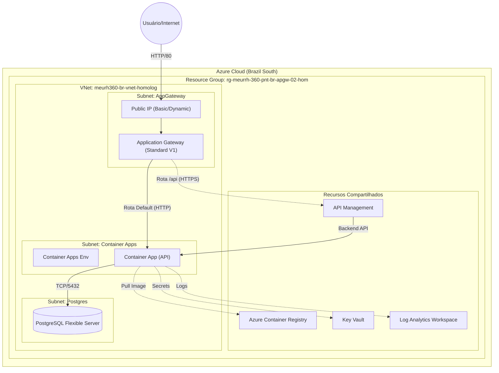

# Ambiente de Homologação Terraform

Este projeto utiliza Terraform para provisionar o ambiente de homologação para o MeuRH360.

## Pré-requisitos

- [Terraform](https://www.terraform.io/downloads.html) instalado.
- [Azure CLI](https://docs.microsoft.com/en-us/cli/azure/install-azure-cli) instalado.
- [Infracost](https://www.infracost.io/docs/) instalado (para estimativa de custos).
- Logado no Azure (`az login`).
- Chave de API do Infracost configurada (`infracost auth login`).

## Estrutura do Projeto

O projeto é modularizado:
- `modules/`: Contém módulos Terraform reutilizáveis (rede, banco de dados, etc.).
- `main.tf`: A configuração raiz que chama os módulos.
- `variables.tf`: Variáveis globais.
- `providers.tf`: Configuração do provedor e backend.

## Passo a Passo para Implantação

### 1. Configurar Backend Remoto (Apenas na primeira vez)

Usamos o Azure Blob Storage para armazenar o arquivo de estado do Terraform com segurança. Execute o script de configuração para criar os recursos necessários.

```powershell
./setup_backend.ps1
```

**Importante:** Observe a saída deste script, especificamente o `storage_account_name` e o comando `terraform init` fornecido no final.

### 2. Inicializar o Terraform

Inicialize o projeto e configure o backend usando os valores da etapa anterior.

```powershell
terraform init `
  -backend-config="resource_group_name=rg-terraform-state" `
  -backend-config="storage_account_name=<NOME_DA_SUA_STORAGE_ACCOUNT>" `
  -backend-config="container_name=tfstate" `
  -backend-config="key=homolog.terraform.tfstate"
```

*Substitua `<NOME_DA_SUA_STORAGE_ACCOUNT>` pelo nome gerado pelo script de configuração.*

### 3. Revisar o Plano

Verifique quais recursos serão criados.

```powershell
terraform plan
```

### 4. Estimativa de Custos (Opcional)

Gere um relatório de custos estimados para a infraestrutura.

Se você tiver o `make` instalado:
```powershell
make cost
```

Ou usando o script PowerShell incluído:
```powershell
.\manage.ps1 -Command cost
```

### 5. Aplicar a Configuração

Crie os recursos no Azure.

```powershell
terraform apply
```

Digite `yes` quando solicitado para confirmar.

### 6. Configuração de DNS

Após a implantação, é necessário configurar as entradas DNS para acessar os serviços.
Consulte o guia detalhado em: [docs/dns_configuration.md](docs/dns_configuration.md).

## Módulos

- **Network**: VNet, Subnets, NSGs.
- **App Gateway**: Application Gateway (Balanceador de Carga).
- **Database**: PostgreSQL Flexible Server.
- **Monitoring**: Log Analytics, App Insights.
- **Containers**: ACR, Container Apps Environment.
- **APIM**: API Management.
- **Security**: Key Vault, Managed Identities.
- **Storage**: Storage Accounts.

## Arquitetura Detalhada

A infraestrutura foi desenhada seguindo o padrão de **Modularização** do Terraform, garantindo isolamento, reutilização e facilidade de manutenção. Abaixo, o detalhamento de cada componente:

### 1. Gerenciamento de Estado (Backend)
Antes de qualquer recurso, configuramos um **Remote Backend** no Azure Blob Storage.
- **Por que?** O Terraform precisa guardar o estado (`.tfstate`) da infraestrutura. Guardar localmente é perigoso (risco de perda e conflito em times).
- **Como:** O script `setup_backend.ps1` cria um Storage Account dedicado e bloqueado para isso.

### 2. Rede (Network Module)
A espinha dorsal do ambiente.
- **VNet:** Uma rede virtual isolada (`10.0.0.0/16`).
- **Subnets:** Segmentação por função:
    - `appgw-subnet`: Exclusiva para o Application Gateway.
    - `aca-subnet`: Delegada para o Azure Container Apps (permite que os containers rodem dentro da VNet).
    - `postgres-subnet`: Delegada para o PostgreSQL (garante que o banco não tenha acesso público direto).
- **Application Gateway:** Atua como balanceador de carga, sendo a única porta de entrada pública. Configurado como **Standard V1 Medium** (sem WAF) para redução de custos.

### 3. Computação (Containers Module)
- **Azure Container Apps (ACA):** Ambiente Serverless para containers. Ele está configurado para usar a VNet, permitindo comunicação segura com o banco de dados.
- **ACR (Registry):** Onde as imagens Docker da aplicação ficam armazenadas.

### 4. Dados (Database Module)
- **PostgreSQL Flexible Server:** Configurado com integração de VNet. Isso significa que ele **não possui IP público**. Apenas recursos dentro da VNet (como o Container App) conseguem acessá-lo.

### 5. Monitoramento e Segurança
- **Log Analytics & App Insights:** Centralizam logs e métricas de performance.
- **Key Vault:** Cofre para guardar senhas e chaves de conexão (embora no código atual tenhamos usado uma senha padrão para inicialização, em produção ela deve ser injetada via Key Vault).

## Diagrama de Arquitetura


