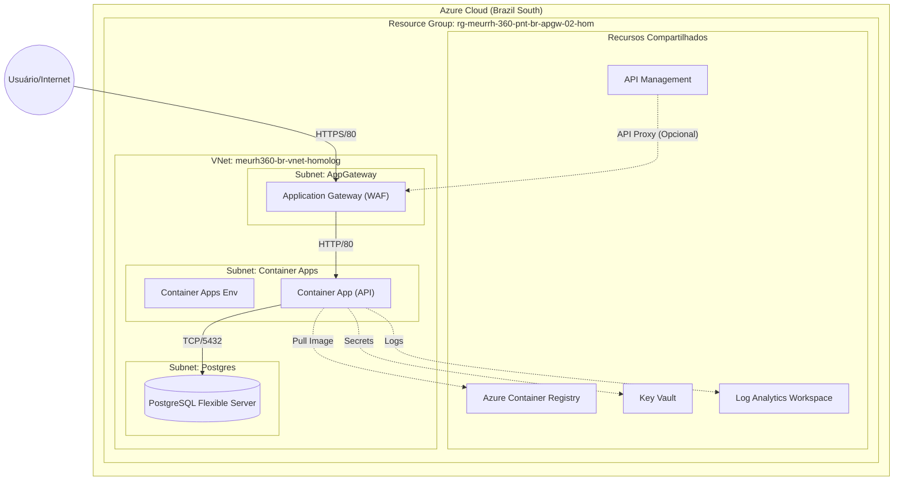

# Terraform Homologation Environment

This project uses Terraform to provision the homologation environment for MeuRH360.

## Prerequisites

- [Terraform](https://www.terraform.io/downloads.html) installed.
- [Azure CLI](https://docs.microsoft.com/en-us/cli/azure/install-azure-cli) installed.
- Logged in to Azure (`az login`).

## Project Structure

The project is modularized:
- `modules/`: Contains reusable Terraform modules (network, database, etc.).
- `main.tf`: The root configuration that calls the modules.
- `variables.tf`: Global variables.
- `providers.tf`: Provider and backend configuration.

## Step-by-Step Deployment

### 1. Setup Remote Backend (First Time Only)

We use Azure Blob Storage to store the Terraform state file securely. Run the setup script to create the necessary resources.

```powershell
./setup_backend.ps1
```

**Important:** Note the output of this script, specifically the `storage_account_name` and the `terraform init` command provided at the end.

### 2. Initialize Terraform

Initialize the project and configure the backend using the values from the previous step.

```powershell
terraform init `
  -backend-config="resource_group_name=rg-terraform-state" `
  -backend-config="storage_account_name=<YOUR_STORAGE_ACCOUNT_NAME>" `
  -backend-config="container_name=tfstate" `
  -backend-config="key=homolog.terraform.tfstate"
```

*Replace `<YOUR_STORAGE_ACCOUNT_NAME>` with the name generated by the setup script.*

### 3. Review the Plan

Check what resources will be created.

```powershell
terraform plan
```

### 4. Apply the Configuration

Create the resources in Azure.

```powershell
terraform apply
```

Type `yes` when prompted to confirm.

## Modules

- **Network**: VNet, Subnets, NSGs, App Gateway.
- **Database**: PostgreSQL Flexible Server.
- **Monitoring**: Log Analytics, App Insights.
- **Containers**: ACR, Container Apps Environment.
- **APIM**: API Management.
- **Security**: Key Vault, Managed Identities.
- **Storage**: Storage Accounts.

## Arquitetura Detalhada

A infraestrutura foi desenhada seguindo o padrão de **Modularização** do Terraform, garantindo isolamento, reutilização e facilidade de manutenção. Abaixo, o detalhamento de cada componente:

### 1. Gerenciamento de Estado (Backend)
Antes de qualquer recurso, configuramos um **Remote Backend** no Azure Blob Storage.
- **Por que?** O Terraform precisa guardar o estado (`.tfstate`) da infraestrutura. Guardar localmente é perigoso (risco de perda e conflito em times).
- **Como:** O script `setup_backend.ps1` cria um Storage Account dedicado e bloqueado para isso.

### 2. Rede (Network Module)
A espinha dorsal do ambiente.
- **VNet:** Uma rede virtual isolada (`10.0.0.0/16`).
- **Subnets:** Segmentação por função:
    - `appgw-subnet`: Exclusiva para o Application Gateway.
    - `aca-subnet`: Delegada para o Azure Container Apps (permite que os containers rodem dentro da VNet).
    - `postgres-subnet`: Delegada para o PostgreSQL (garante que o banco não tenha acesso público direto).
- **Application Gateway:** Atua como balanceador de carga e WAF (Web Application Firewall), sendo a única porta de entrada pública.

### 3. Computação (Containers Module)
- **Azure Container Apps (ACA):** Ambiente Serverless para containers. Ele está configurado para usar a VNet, permitindo comunicação segura com o banco de dados.
- **ACR (Registry):** Onde as imagens Docker da aplicação ficam armazenadas.

### 4. Dados (Database Module)
- **PostgreSQL Flexible Server:** Configurado com integração de VNet. Isso significa que ele **não possui IP público**. Apenas recursos dentro da VNet (como o Container App) conseguem acessá-lo.

### 5. Monitoramento e Segurança
- **Log Analytics & App Insights:** Centralizam logs e métricas de performance.
- **Key Vault:** Cofre para guardar senhas e chaves de conexão (embora no código atual tenhamos usado uma senha padrão para inicialização, em produção ela deve ser injetada via Key Vault).

## Diagrama de Arquitetura


